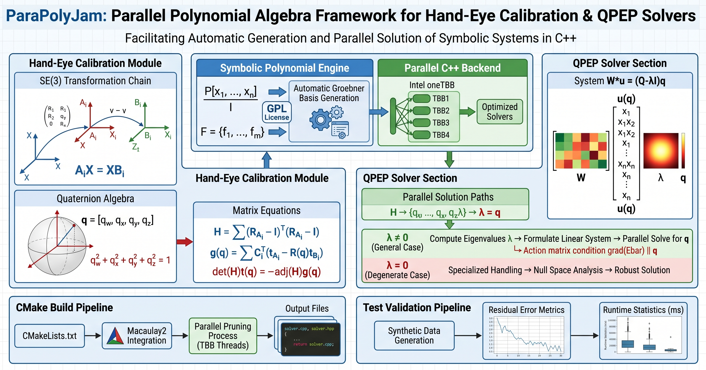

# ParaPolyJam



**Library**: ParaPolyJam

**Brief**:   ParaPolyJam is a powerful toolbox for symbolic polynomial computations
         and automatic Groebner basis solver generation in parallel C++ with Intel oneTBB. This work was originated from the previous PolyJam project by Prof. Laurent Kneip in https://github.com/laurentkneip/polyjam, where there is no parallelism and the solver generation would be very slow. It is released
         under the GPL license. For use in proprietary applications, please
         contact the author. Please consult the documentation for more information.

**Author**:  Jin Wu, Professor, University of Science and Technology Beijing;  Laurent Kneip, Professor, ShanghaiTech University

**Contact**: wujin@ustb.edu.cn; kneip.laurent@gmail.com

## Hand-eye AX=XB

This distribution has been extended with a top-level CMake build that generates a Groebner-basis solver for the hand-eye calibration problem

```text
A_i X = X B_i,  i = 1..N
```

where all transforms are elements of `SE(3)`. The default generated solver uses `N=2` motion pairs; this can be changed at configure time with `-DPOLYJAM_HAND_EYE_PAIRS=<N>`.

## Solver Formulation

The solver now follows the requested sequential formulation.

For `X=[R(q),t]`, with unit quaternion `q=[q_w,q_x,q_y,q_z]`, it first constructs the scalar Euclidean least-squares objective

```text
E(q,t) = sum_i || R_Ai R(q) - R(q) R_Bi ||_F^2
       + sum_i || (R_Ai-I)t + t_Ai - R(q)t_Bi ||_2^2 .
```

The translation part is eliminated analytically from the Jacobian of the objective. Defining

```text
C_i = R_Ai - I
H   = sum_i C_i^T C_i
g(q)= sum_i C_i^T (t_Ai - R(q)t_Bi),
```

the translation stationarity condition is

```text
H t + g(q) = 0.
```

Polyjam's symbolic coefficient field does not support symbolic division, so the generator uses the determinant-cleared equivalent

```text
det(H) t(q) = -adj(H) g(q).
```

It substitutes this expression back into the original Euclidean objective and clears the denominator:

```text
Ebar(q) = det(H)^2 sum_i || R_Ai R(q) - R(q) R_Bi ||_F^2
        + sum_i || C_i(-adj(H)g(q)) + det(H)(t_Ai - R(q)t_Bi) ||_2^2.
```

For generic motion pairs with `det(H) != 0`, `Ebar(q)` has the same quaternion critical points as the translation-eliminated objective.

The generated Groebner-basis core solves only the quaternion critical system. It enforces the unit-quaternion constraint

```text
q_w^2 + q_x^2 + q_y^2 + q_z^2 = 1
```

and eliminates the Lagrange multiplier by requiring `grad(Ebar)` to be parallel to `q`, using the six equations

```text
q_i * dEbar/dq_j - q_j * dEbar/dq_i = 0,  0 <= i < j <= 3.
```

After the quaternion is recovered, the public wrapper reconstructs translation sequentially by solving

```text
t = -H^{-1} g(q)
```

in double precision.

## Build targets

```bash
cmake -S . -B build -DPOLYJAM_HAND_EYE_PAIRS=2 -DPOLYJAM_MACAULAY_COMMAND=M2
cmake --build build --target polyjam_generate_handeye_axxb
cmake --build build --target generate_handeye_axxb_solver
cmake --build build --target test_handeye_axxb
cmake --build build --target run_handeye_axxb_test
```

`generate_handeye_axxb_solver` runs the Polyjam generator and writes the quaternion-only Groebner core:

```text
polyjam_solvers/handeye_axxb_q/handeye_axxb_q.cpp
polyjam_solvers/handeye_axxb_q/handeye_axxb_q.hpp
```

The public wrapper lives in:

```text
polyjam_solvers/handeye_axxb/handeye_axxb.cpp
polyjam_solvers/handeye_axxb/handeye_axxb.hpp
```

The public solver has the signature:

```cpp
polyjam::handeye_axxb::solve(
    std::vector<Eigen::Matrix4d> & A,
    std::vector<Eigen::Matrix4d> & B,
    std::vector<Eigen::Matrix<double,7,1> > & solutions);
```

Each public solution is ordered as:

```text
[q_w, q_x, q_y, q_z, t_x, t_y, t_z]^T
```

Because `q` and `-q` represent the same rotation, the quaternion-only core may recover both signs for the same hand-eye rotation. The wrapper normalizes the quaternion and returns a deterministic sign with nonnegative `q_w`.

The test executable synthesizes a ground-truth `X`, generates consistent random `A_i` and `B_i` pairs on `SE(3)`, invokes the public wrapper, and reports the best AX=XB residual plus rotation/translation/quaternion-norm error.

## Dependencies

The Polyjam generator target needs Macaulay2 available as `M2` or via `-DPOLYJAM_MACAULAY_COMMAND=<command>`. The synthetic test target needs Eigen. OpenCV visualization is optional and disabled by default; enable it with `-DPOLYJAM_USE_OPENCV=ON`.

All CMake targets in the modified project are built with `-w -O3` as requested.

## Additional `W*u = (Q - lambda I) q` Solver (QPEP)

This package also includes a second Polyjam generator for the following quadratic pose estimator (QPEP) in

```text
W * u(q) = (Q - lambda * I_4) * q
q^T q = 1
```

where `W` is `4x64`, `Q` is `4x4`, `lambda` is a scalar unknown, and `q=[q_w,q_x,q_y,q_z]^T` is a unit quaternion. The 64-vector is defined as the cubic Kronecker monomial vector

```text
u[(a*4+b)*4+c] = q[a] * q[b] * q[c],  a,b,c in {0,1,2,3}.
```

The generated core solver has five unknowns ordered as

```text
[lambda, q_w, q_x, q_y, q_z]^T
```

and takes a coefficient vector containing `W` followed by `Q`, both in row-major order. A public Eigen wrapper is provided at:

```text
polyjam_solvers/wu_q_lambda/wu_q_lambda.cpp
polyjam_solvers/wu_q_lambda/wu_q_lambda.hpp
```

with signature:

```cpp
polyjam::wu_q_lambda::solve(
    const Eigen::Matrix<double,4,64> & W,
    const Eigen::Matrix4d & Q,
    std::vector<Eigen::Matrix<double,5,1> > & solutions);
```

Build and test it from the repository root with:

```bash
cmake -S . -B build -DPOLYJAM_MACAULAY_COMMAND=M2
cmake --build build --target polyjam_generate_wu_q_lambda
cmake --build build --target generate_wu_q_lambda_solver
cmake --build build --target test_wu_q_lambda
cmake --build build --target run_wu_q_lambda_test
```

The synthetic test constructs a random unit quaternion and lambda, samples a random `W`, constructs a consistent `Q`, invokes the generated solver through the wrapper, and checks the recovered candidates against the polynomial residual and the known `[lambda,q]` solution.

## Additional lambda-free `W*u = Q*q` selected-row solver

This package now also includes a solver for the system obtained by setting `lambda = 0` in

```text
W * u(q) = (Q - lambda * I_4) * q,
q^T q = 1.
```

With `lambda` zeroed, the first four equations are the four residual rows

```text
W_i * u(q) - Q_i * q = 0,  i = 0..3,
```

and the fifth equation is the unit-quaternion constraint.  The generated solver selects three of the first four residual rows and combines them with the fifth equation, giving a square four-equation system in only the quaternion unknowns

```text
[q_w, q_x, q_y, q_z]^T.
```

The default public wrapper uses rows `{0,1,2}`.  An overload accepts any three distinct rows from `{0,1,2,3}` and packs those rows into the three-row coefficient vector expected by the generated core.  The generated core lives at:

```text
polyjam_solvers/wu_q_lambda0_core/wu_q_lambda0_core.cpp
polyjam_solvers/wu_q_lambda0_core/wu_q_lambda0_core.hpp
```

The public wrapper and test live at:

```text
polyjam_solvers/wu_q_lambda0/wu_q_lambda0.cpp
polyjam_solvers/wu_q_lambda0/wu_q_lambda0.hpp
polyjam_solvers/wu_q_lambda0/test_wu_q_lambda0.cpp
```

Build and test it from the repository root with:

```bash
cmake -S . -B build -DPOLYJAM_MACAULAY_COMMAND=M2
cmake --build build --target polyjam_generate_wu_q_lambda0
cmake --build build --target generate_wu_q_lambda0_solver
cmake --build build --target test_wu_q_lambda0
cmake --build build --target run_wu_q_lambda0_test
```

The synthetic test constructs a random unit quaternion, samples a random `W`, constructs a `Q` that satisfies all four rows of `W*u(q)=Q*q`, and then tests the generated selected-row solver for all four possible three-row selections.

## Additional MATLAB-style `M1`/`M2` `gX`/`gY` monomial solver

This package also includes a Groebner-basis solver for the six-equation system

```text
eqs(1:3) = M1 * mons1(gX1,gX2,gX3,gY1,gY2,gY3)'
eqs(4:6) = M2 * mons4(gX1,gX2,gX3,gY1,gY2,gY3)'
```

where `M1` is `3x40`, `M2` is `3x56`, and the unknown vector is ordered as

```text
[gX1, gX2, gX3, gY1, gY2, gY3]^T.
```

The generator preserves the MATLAB monomial order supplied in the request.  The
coefficient vector passed to the generated core is

```text
[M1(:)' row-major, M2(:)' row-major]
```

with 288 total scalar coefficients.  The generated core is written to

```text
polyjam_solvers/gxy_monomial_core/gxy_monomial_core.cpp
polyjam_solvers/gxy_monomial_core/gxy_monomial_core.hpp
```

and the public Eigen wrapper lives at

```text
polyjam_solvers/gxy_monomial/gxy_monomial.cpp
polyjam_solvers/gxy_monomial/gxy_monomial.hpp
```

with signature

```cpp
polyjam::gxy_monomial::solve(
    const Eigen::Matrix<double,3,40> & M1,
    const Eigen::Matrix<double,3,56> & M2,
    std::vector<Eigen::Matrix<double,6,1> > & solutions);
```

Build and test it from the repository root with:

```bash
cmake -S . -B build -DPOLYJAM_MACAULAY_COMMAND=M2 -DPOLYJAM_TEST_SEEDS=100
cmake --build build --target polyjam_generate_gxy_monomial
cmake --build build --target generate_gxy_monomial_solver
cmake --build build --target test_gxy_monomial
cmake --build build --target run_gxy_monomial_test
```

The executable also accepts the seed count directly:

```bash
./build/test_gxy_monomial 100
```

All synthetic test executables now run over a configurable RNG seed count and
report min, max, mean, and median statistics for the relevant errors, returned
solution count, and solver runtime.  Configure the default seed count with
`-DPOLYJAM_TEST_SEEDS=<N>` or pass `<N>` as the first executable argument.

## Statistical Synthetic Tests

The synthetic test executables now loop over RNG seeds and report min, max, mean, and median statistics for the relevant errors, solution counts, and solve time in milliseconds.  The default number of seeds is controlled by:

```bash
-DPOLYJAM_TEST_SEEDS=100
```

Each test executable also accepts an optional first command-line argument for the number of seeds; the new `gxy_monomial` test accepts an optional second argument for the first seed.

## Parallel Row-Basis Pruning for Solver Generation

This version also implements a parallel speedup pass for Polyjam's Macaulay-template equation pruning.  The old generator removed unnecessary equations by repeatedly deleting candidate rows, reducing the resulting matrix, and checking whether the action-matrix rows were still present.  That path is still available as a verified fallback, but the default generator now uses a row-space-preserving pruning strategy.

The new pass works as follows:

```text
1. Build the full Macaulay/prolongation matrix over the finite-field sample.
2. Split the candidate equation rows into blocks.
3. Compute a row basis of every block independently.
4. Merge block row bases in a binary reduction tree.
5. Verify that the pruned template still contains the required action rows.
6. Fall back to the original serial safe-removal pass if verification fails.
```

The selected rows are always original Polyjam template equations, not generated linear-combination rows, so the existing code-generation path remains unchanged.  The correctness criterion is row-space preservation: if the selected rows span the same Macaulay row space as the full template, then the row-reduced relations and the action-matrix extraction are unchanged for the same monomial support.  The final `contains(goodPolynomials)` verification is retained as a practical certificate before code extraction.

Parallelism is now provided by the vendored oneTBB source package under:

```text
third_party/oneTBB-2019_U9
```

No system TBB installation or OpenMP support is required.  Configure it with:

```bash
cmake -S . -B build \
  -DPOLYJAM_ENABLE_PARALLEL_PRUNING=ON \
  -DPOLYJAM_TBB_ROOT=/path/to/oneTBB-2019_U9 \
  -DPOLYJAM_PARALLEL_PRUNING_THREADS=0 \
  -DPOLYJAM_PARALLEL_PRUNING_MIN_BLOCK_ROWS=64
```

`POLYJAM_TBB_ROOT` defaults to the bundled `third_party/oneTBB-2019_U9` directory.  `POLYJAM_PARALLEL_PRUNING_THREADS=0` uses the oneTBB default worker count; a positive value caps oneTBB parallelism through `tbb::global_control`.  `POLYJAM_TBB_BUILD_JOBS` controls the number of jobs used while building the bundled oneTBB library.  To recover the older pruning behavior exactly, configure with:

```bash
-DPOLYJAM_ENABLE_PARALLEL_PRUNING=OFF
```


# References
1. **Wu, J.**, et al. (2022)
           Quadratic Pose Estimation Problems: Globally Optimal Solutions, 
           Solvability/Observability Analysis and Uncertainty Description, ***IEEE Transactions on Robotics***, https://doi.org/10.1109/TRO.2022.3155880.

2. **Wu, J.**, et al. (2020). Globally Optimal Symbolic Hand-Eye Calibration. ***IEEE/ASME Transactions on Mechatronics***, https://doi.org/10.1109/TMECH.2020.3019306
